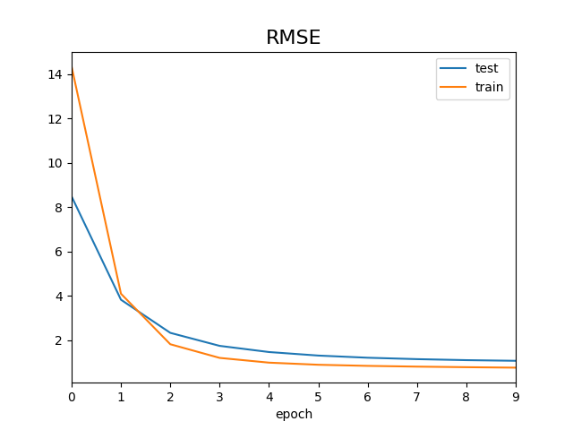

# torchmf

matrix factorization in PyTorch

## Installation

### pip

```commandline
pip install -r requirements.txt
```

### conda

```commandline
conda env create -f environment.yml
conda activate torchmf
```

## Example

```bash
$ python run.py --example explicit
( 1 ): 100%|████████████████████████████████████████████████████████| 89/89 [00:01<00:00, 85.88it/s, train_loss=7.9]
Epoch:  1   train:  15.04790 val:  8.84972
( 2 ): 100%|███████████████████████████████████████████████████████| 89/89 [00:01<00:00, 84.06it/s, train_loss=2.96]
Epoch:  2   train:  4.34132  val:  4.04638
( 3 ): 100%|███████████████████████████████████████████████████████| 89/89 [00:01<00:00, 81.54it/s, train_loss=1.51]
Epoch:  3   train:  1.87918  val:  2.43315
( 4 ): 100%|███████████████████████████████████████████████████████| 89/89 [00:01<00:00, 85.55it/s, train_loss=1.19]
Epoch:  4   train:  1.21419  val:  1.80296
( 5 ): 100%|██████████████████████████████████████████████████████| 89/89 [00:00<00:00, 90.87it/s, train_loss=0.945]
Epoch:  5   train:  0.99693  val:  1.49770
( 6 ): 100%|██████████████████████████████████████████████████████| 89/89 [00:00<00:00, 89.33it/s, train_loss=0.914]
Epoch:  6   train:  0.90174  val:  1.33501
( 7 ): 100%|██████████████████████████████████████████████████████| 89/89 [00:00<00:00, 115.70it/s, train_loss=0.83]
Epoch:  7   train:  0.85230  val:  1.23783
( 8 ): 100%|██████████████████████████████████████████████████████| 89/89 [00:01<00:00, 88.85it/s, train_loss=0.879]
Epoch:  8   train:  0.82072  val:  1.17781
( 9 ): 100%|█████████████████████████████████████████████████████| 89/89 [00:00<00:00, 119.93it/s, train_loss=0.766]
Epoch:  9   train:  0.79898  val:  1.13976
(10 ): 100%|█████████████████████████████████████████████████████| 89/89 [00:00<00:00, 122.18it/s, train_loss=0.736]
Epoch: 10   train:  0.77820  val:  1.10951
```

which looks something like


